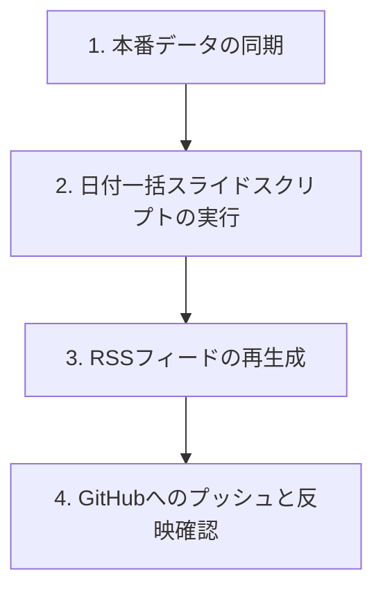

# ポッドキャスト公開日付（pubDate）の一括スライド・メンテナンス手順書

本手順書は、ポッドキャストのエピソード配信スケジュールに「歯抜け（空き日）」が発生した際、最新エピソードを起点として規則正しく（例：1日2エピソードずつ）日付を遡らせて綺麗に整列し直すための手順をまとめたものです。

---

## メンテナンスの流れ

日付変更のプロセスは大きく分けて以下の 4 ステップで進行します。



---

## ステップ 1: 本番データの同期

GitHub Actions等により本番サーバーで更新された最新のSQLiteデータベースをローカルに取得します。
本番のデータベース（`councils.db`）が最新になっていることを確認し、ローカルの `councils.db` に上書きします。

> [!WARNING]
> ローカルのデータベースを誤ってそのまま上書きプッシュすると、本番で生成された最新のエピソードデータが消えてしまうリスクがあります。作業前に必ず最新のDBをダウンロードまたはプルしてください。

---

## ステップ 2: 日付一括スライドスクリプトの実行

日付を再分配するための Python スクリプトを実行します。

### スクリプトの場所
[update_podcast_dates.py](file:///Users/kohei/Myproject/ene/notebooklm-podcast-lab/scripts/update_podcast_dates.py)

### 動作概要
このスクリプトは、DB上の `council_updates` テーブルにおいて、`podcast_status = 'done'`（配信完了済み）のエピソードを「審議会日程（タイトル）」の降順でソートし、指定した基準日（デフォルトは今日）から順に「1日2エピソード」のペースで遡るように `podcast_date` を一括更新します。

### 実行手順
1. 仮想環境の Python を使用してスクリプトを実行します。
   ```bash
   cd notebooklm-podcast-lab
   ./.venv/bin/python3 scripts/update_podcast_dates.py
   ```
   ※ 基準日を明示的に指定したい場合は、スクリプト内の `base_date` 変数（例：`datetime(2026, 6, 5)`）を直接編集してから実行してください。

---

## ステップ 3: RSSフィードの再生成

DBの日付更新後、その内容を `podcast.xml`（RSSフィード）に反映させます。

### 実行手順
1. 同じディレクトリで `upload_and_rss.py` を実行します。
   ```bash
   ./.venv/bin/python3 upload_and_rss.py
   ```
   ※ ローカル環境の `.env` から自動的に R2 などの認証情報がロードされ、ローカルの新規 MP3 ファイルがあれば自動で R2 にアップロードされた後、JST（+0900）タイムゾーンが付与された `podcast.xml` が自動生成されます。

---

## ステップ 4: GitHubへのプッシュと反映確認

生成された XML と DB をリポジトリに反映し、本番環境（Vercel）にデプロイします。

### 実行手順
1. 変更されたファイルを Git に追加してプッシュします。
   ```bash
   git add councils.db podcast.xml notebooklm-podcast-lab/upload_and_rss.py
   git commit -m "chore: redistribute podcast dates and rebuild RSS feed"
   git push origin main
   ```
2. Vercel のデプロイ（約1分）が完了した後、本番URLにアクセスして表示を確認します。
   - [Energy Audio (本番URL)](https://energy-audio.vercel.app/)

---

## 仕組み・技術的補足

メンテナンス時に知っておくべき、システムの重要な仕様です。

### 1. 最新順（降順）でのフィード出力
`feedgen` ライブラリの仕様により、RSSの `<item>` は新しいものが一番上（降順）になるよう `fg.add_entry(order="append")` を指定して生成しています。フロントエンド（`index.html`）はこれをそのままの順番で上からレンダリングします。

### 2. タイムゾーン (JST / +0900)
日付のずれ（表示上が翌日になってしまう問題）を防ぐため、`upload_and_rss.py` 内で DB の `podcast_date` をパースする際、明示的に `+0900`（JST）のタイムゾーンを設定しています。これにより、日本時間表記のブラウザでパースした際にも日付がずれません。

### 3. フロントエンドのキャッシュバスティング
`index.html` と `lp.html` では、`podcast.xml` をフェッチする際にクエリパラメータとしてタイムスタンプを付与しています。
```javascript
const response = await fetch('podcast.xml?t=' + new Date().getTime());
```
これにより、ブラウザの強力なローカルキャッシュを回避し、日付スライド実行後もユーザーがキャッシュクリアすることなく、常に最新の日付並びが瞬時に表示されます。
